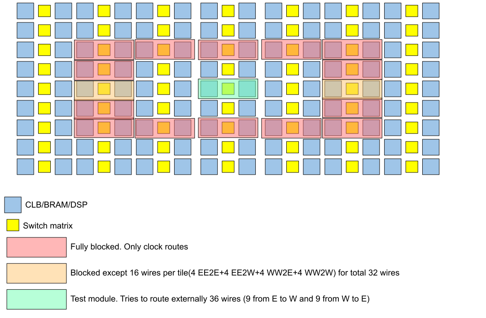
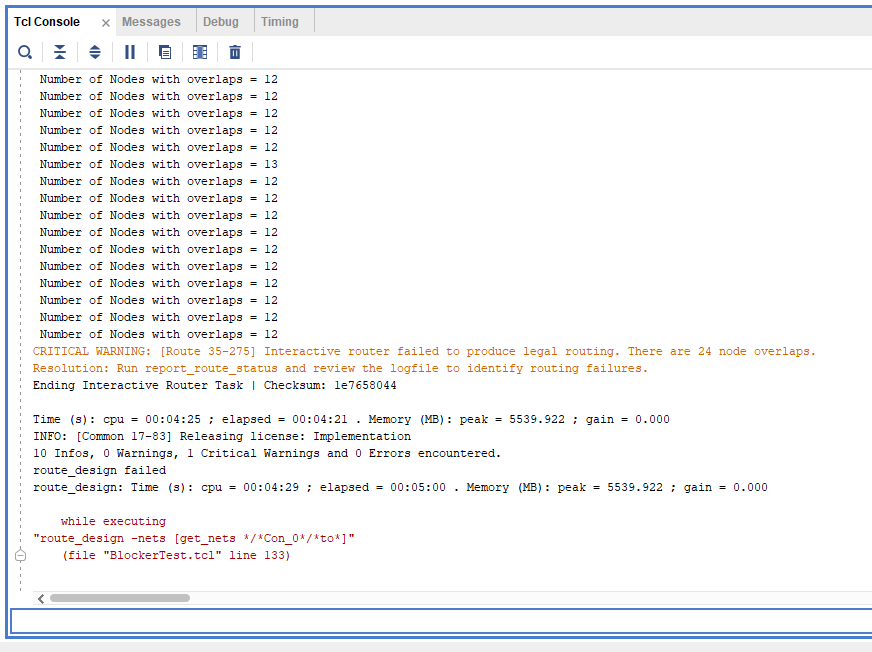

# Blocker Test

This project tests TedTCL in its ability to block Vivado from using certain wires when routing interfaces for runtime partial reconfiguration purposes.
The project has been tested on Vivado 20.1 using a small placeholder module.
### How does that work?
A small module implements logic that tries to route externally to 36 wires.
Essentially the module tries to route 9 input+9 output wires to east direction and 9 input+9 output wires to west direction.
However, we use TedTCL to generate a blocker that produces opening for only 32 wires (8/8 I/O on both east and west):

### What should happen?
Vivado should not be able to route all 36 wires.

### What MUST not happen?
Vivado breaking blocker and deciding to still route through blocked wires.

### So, what happened?

