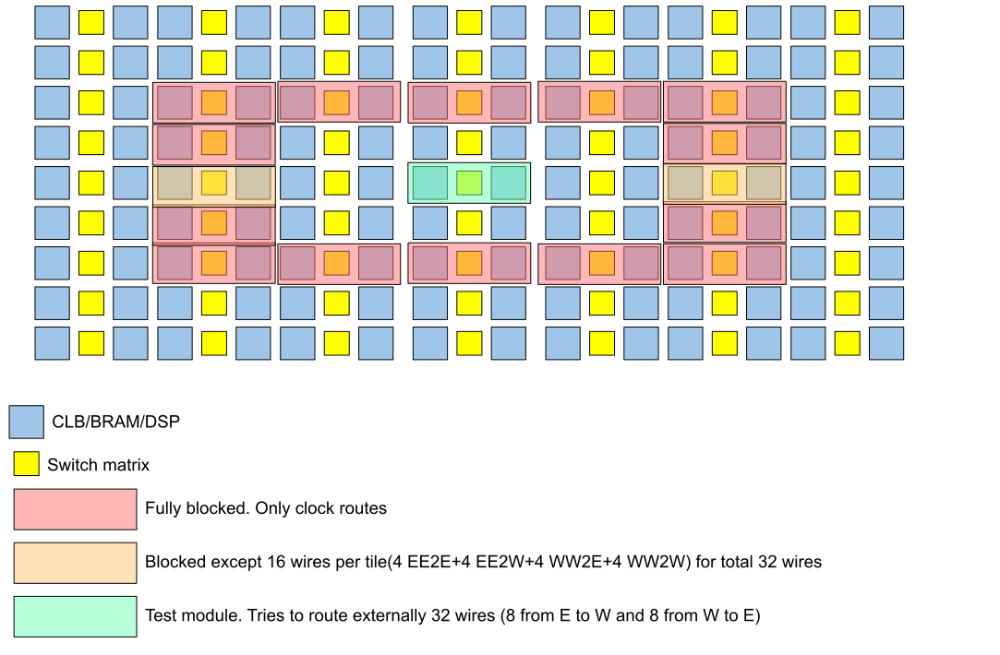
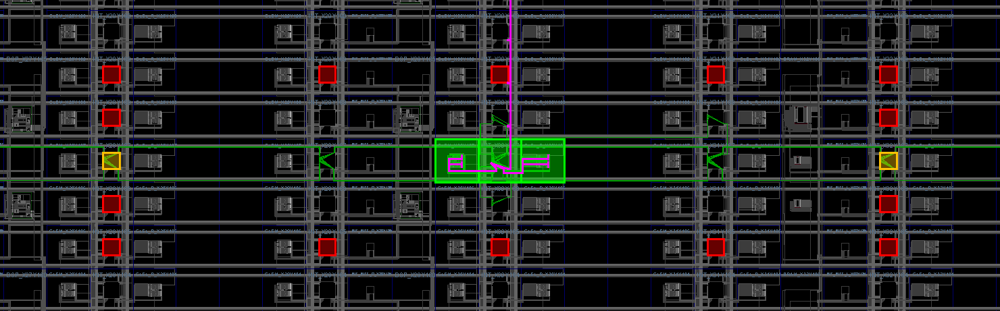

# Blocker Test (Successful)

As opposed to the [Blocker Test](../BlockerTest/), we run the same setup, but trying to route only as much wires as there are openings in the blocker.
The project has been tested on Vivado 20.1 using a small placeholder module.
### How does that work?
A small module implements logic that tries to route externally to 32 wires.
Essentially the module tries to route 8 input+8 output wires to east direction and 8 input+8 output wires to west direction.
We use TedTCL to generate the exact same blocker as in the [Blocker Test](../BlockerTest/) that produces opening for 32 wires (8/8 I/O on both east and west):

### What should happen?
Vivado should be able to route the 32 wires.

### What happened?

The tools successfully route the interface wires through the holes we put in the blocker as seen by the end result in the following screenshot:

(Noting that the vertial purple wire is a clock signal that is also routed through a hole in the clock blocker)

