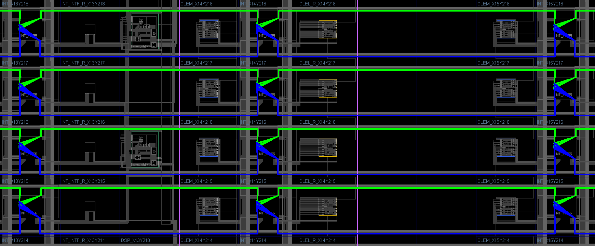

Regular routing:
Purple lines outline double-column border.
Green wires stream from right to left. Blue wires stream from left to right.

Zoomed out:

Zoomed in:

Regular routing:

Regular routing:

