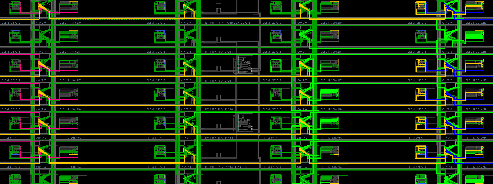
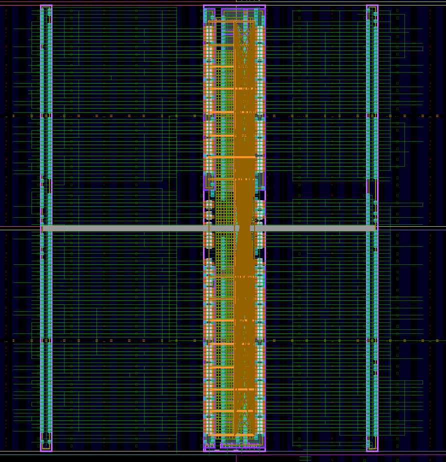
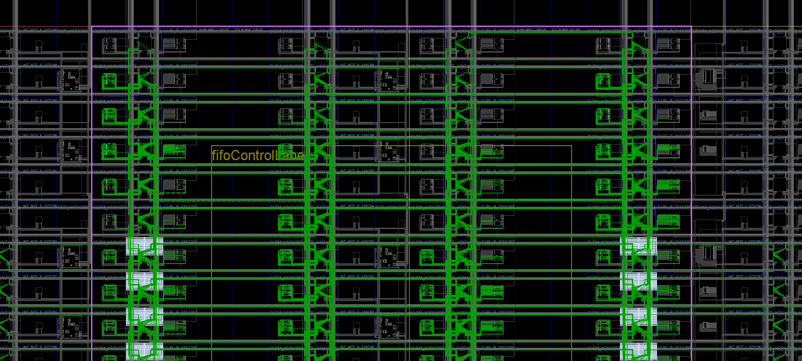

Filter internals and interface:

Left to right stream: Light green wires are input (on right) and Red wires are output (on left).

Right to left stream: Orange wires are input (on left) and Blue wires are output (on right).

Dark green wires are internal routing within the module.

Full PR module:

Zoomed PR module at top:

