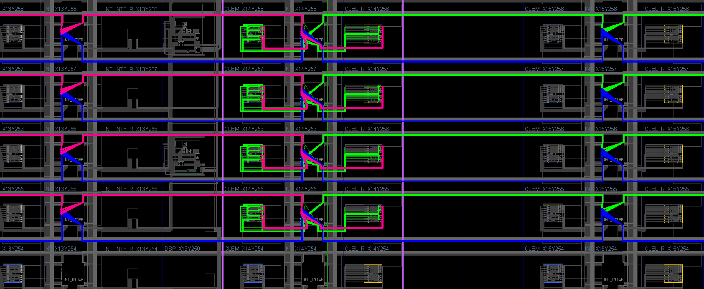
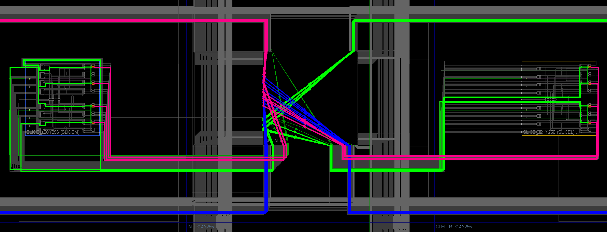
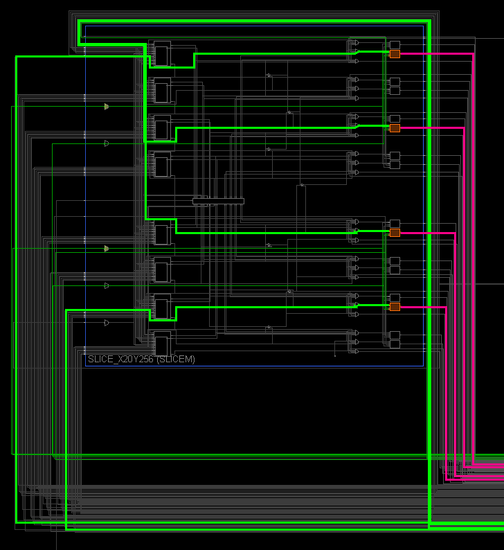
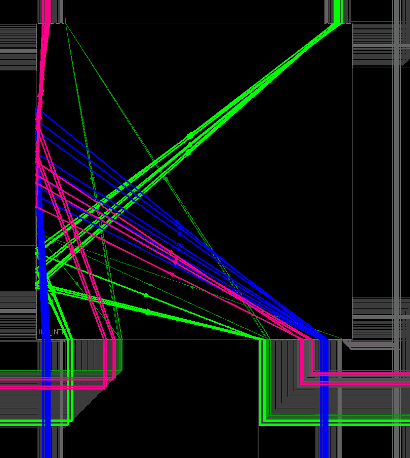
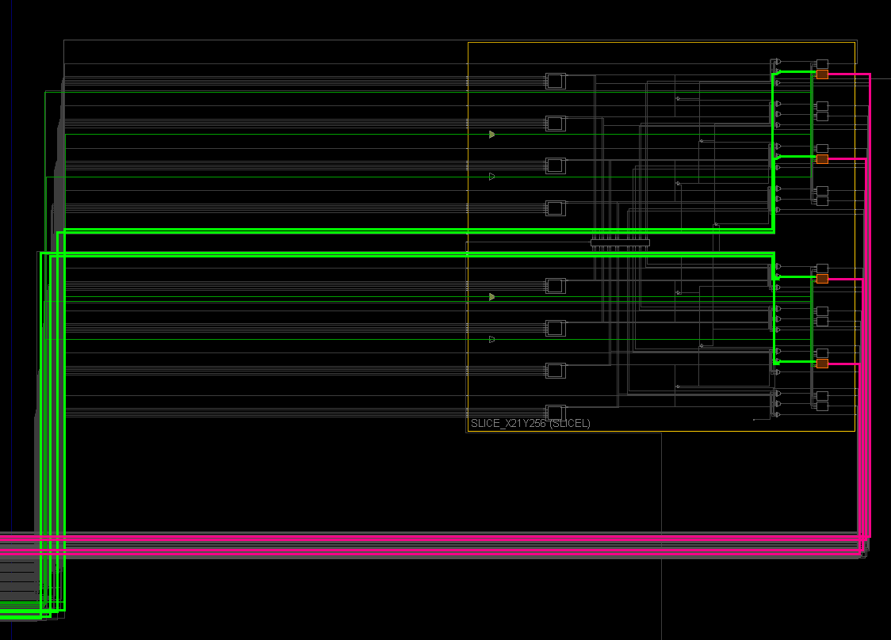
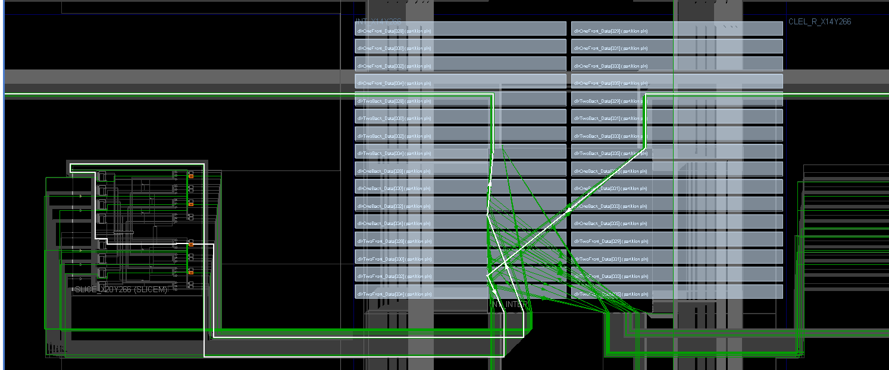
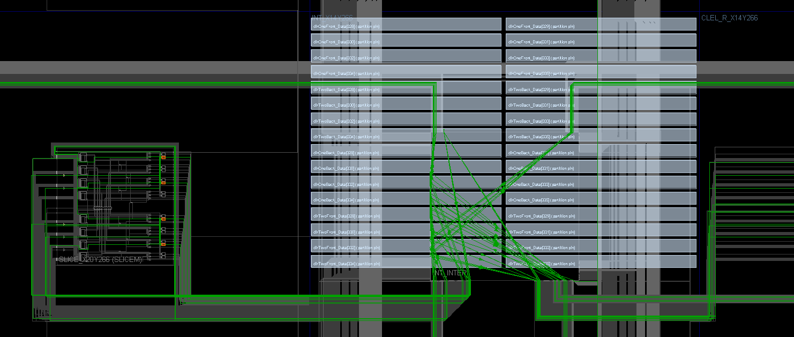

Regular routing:
Purple lines outline double-column border.
Green and red wires stream from right to left (green are before pipeline stage, red are after). Blue wires stream from left to right.

Zoomed out:

Zoomed in:

Left CLB:

Interconnect:

Right CLB:

Regular routing:

Regular routing:

Regular routing:

