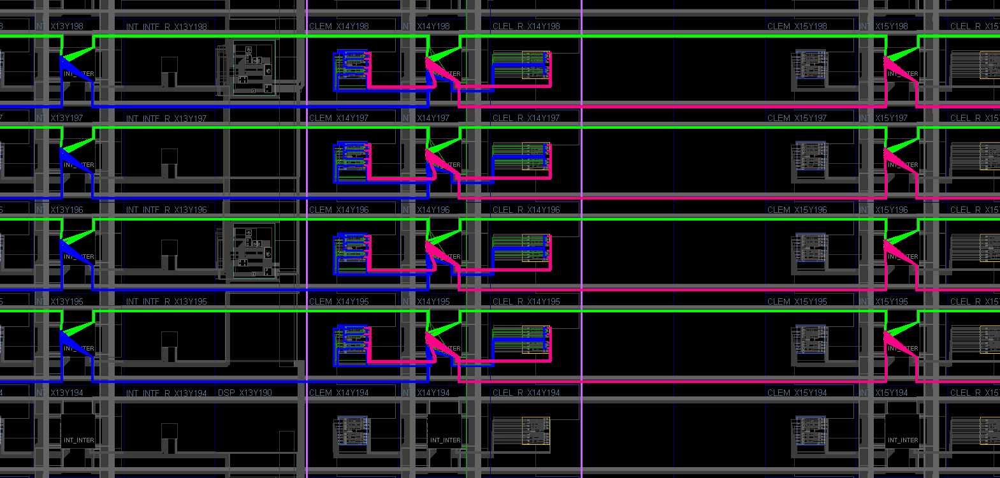
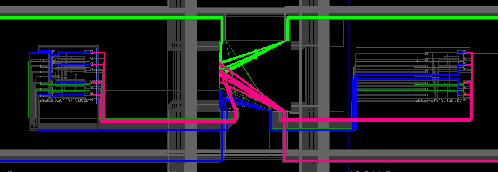
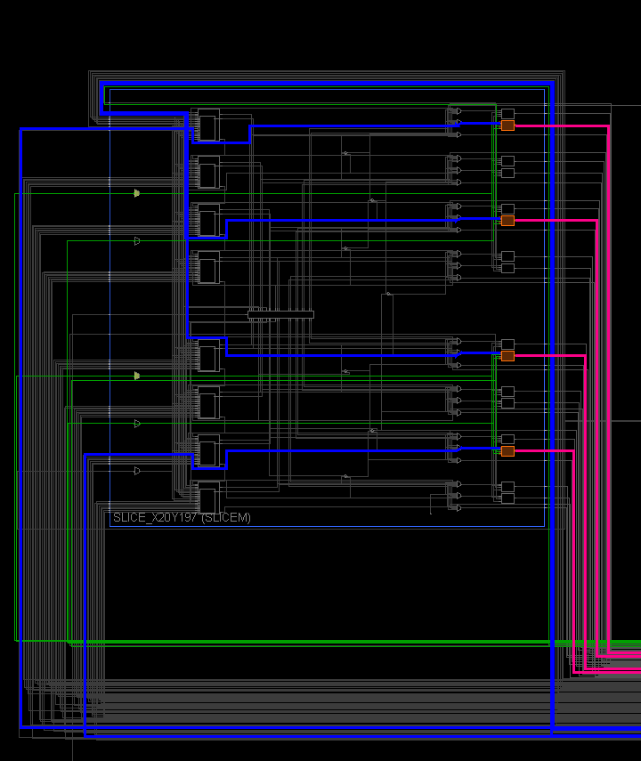
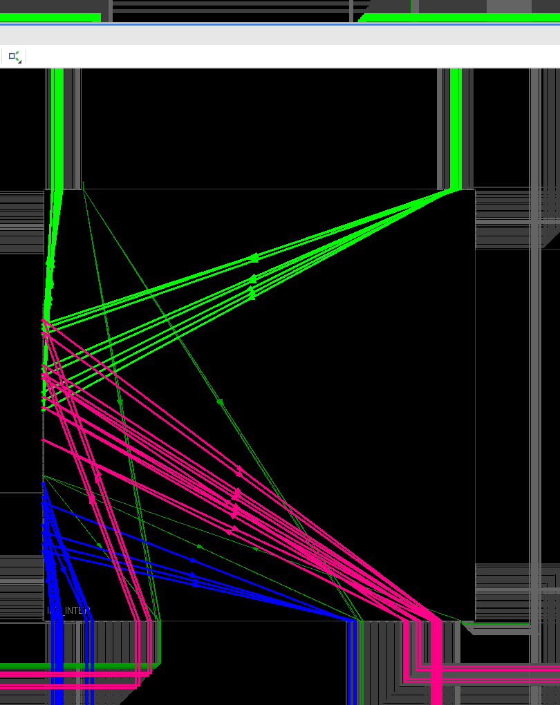
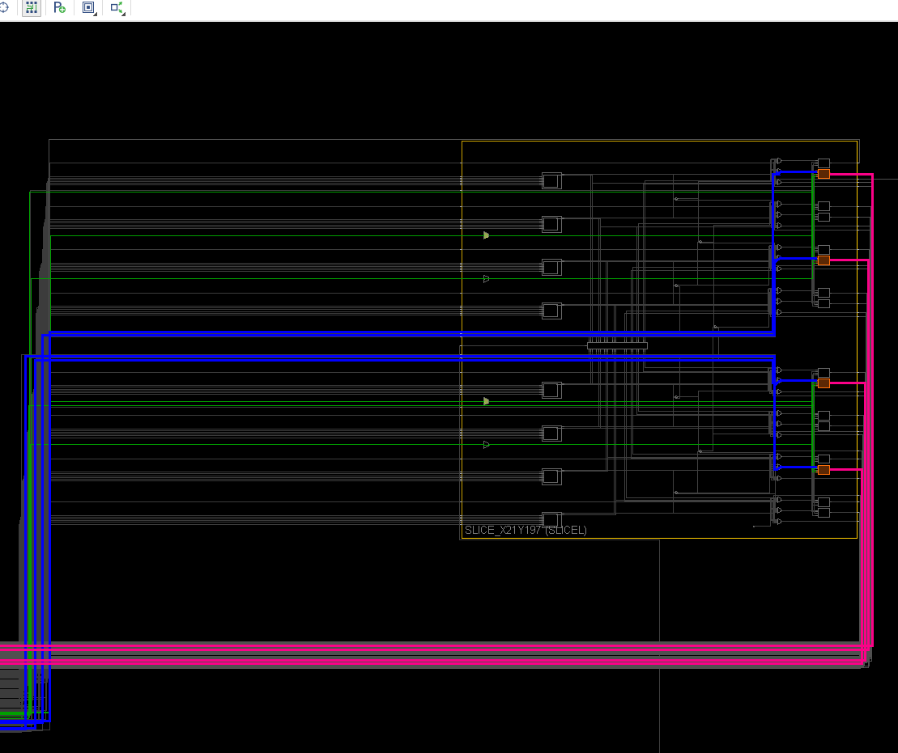
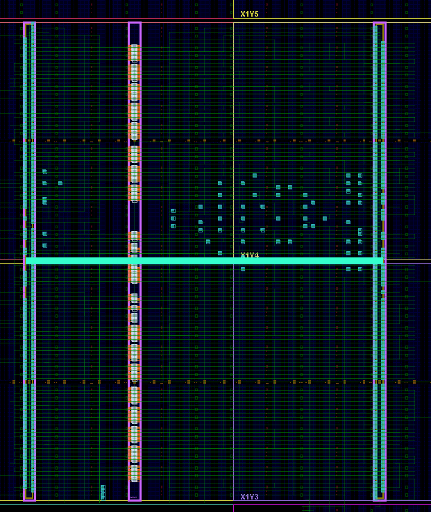
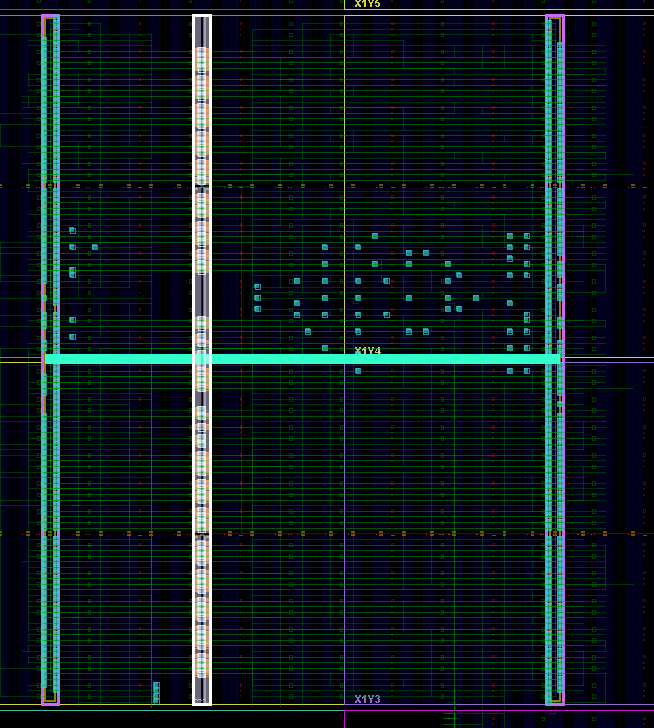
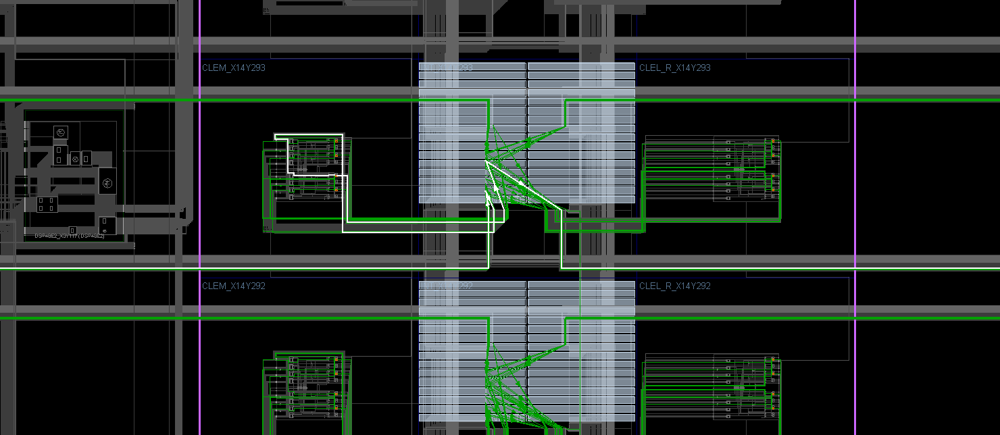
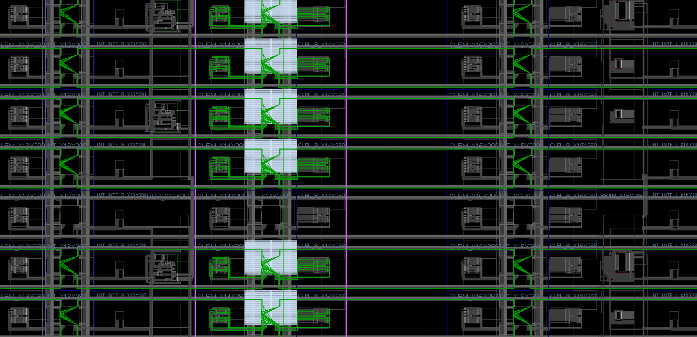

Regular routing:
Purple lines outline double-column border.
Blue and red wires stream from left to right (blue are before pipeline stage, red are after). Green wires stream from right to left.

Zoomed out:

Zoomed in:

Left CLB:

Interconnect:

Right CLB:

Full PR module:

Full PR module selected (white):

Regular routing:

Regular routing:

